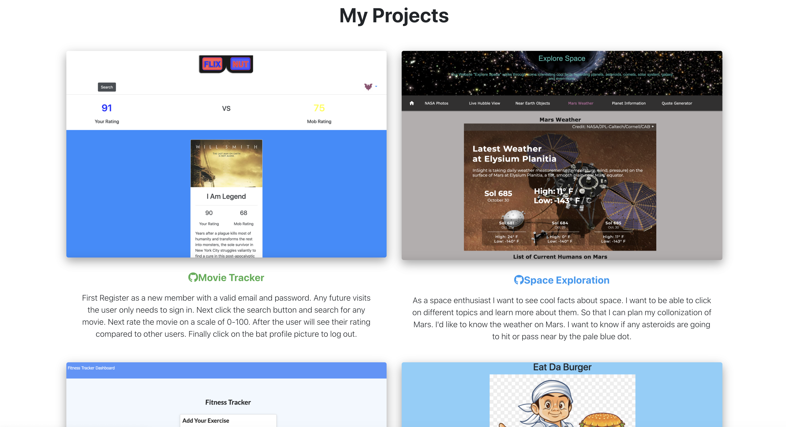
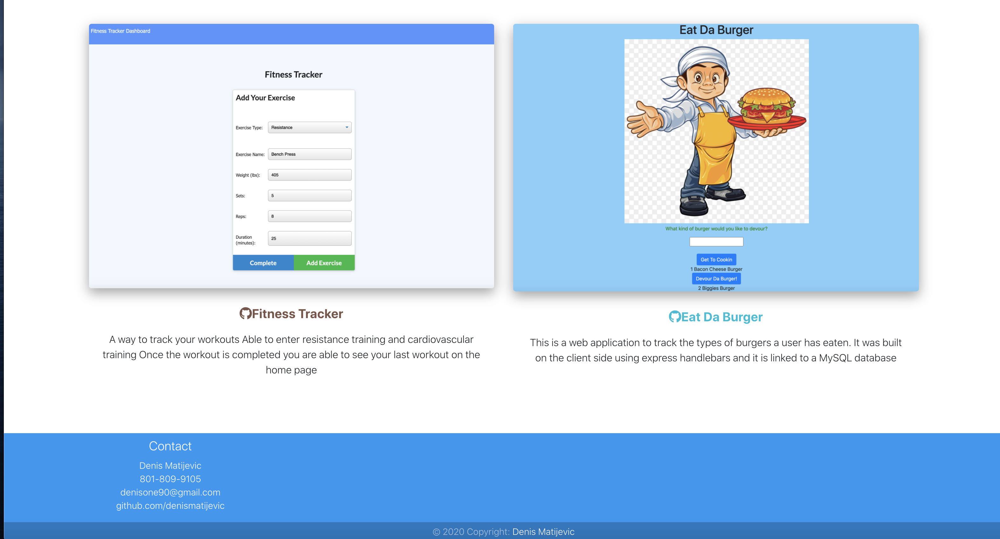

# React Portfolio

# Table of Contents

* [Process](#Process)
* [Issues](#Issues)
* [Link](#Link)
* [Screenshot](#Screenshot)

## Description
* In this project I've created a responsive portfolio. 
* The portfolio consists of three different tabs, which all work and you can switch back and fourth between them
* The about me includes a picture of me and a description of who I am. 
* The portfolio tab includes links to my github and my linkedin.
* There are clickable pictures which will take you to my team projects.
* The contact tab includes a place for a name, email and a message. 
* I used HTML and CSS to complete this project. I utilzed bootstrap as well.
* Along with a lot of "google fu"

## Issues
* Ran into hosting issues, went with Heroku and was able to get it hosted after a bit of a battle. 

## Future-Plans
* Add the final project to the portfolio
* Animate some of the text input and activate all links

## Link 

[Link to my portfolio](https://fathomless-wave-24563.herokuapp.com/)

## Screenshot

