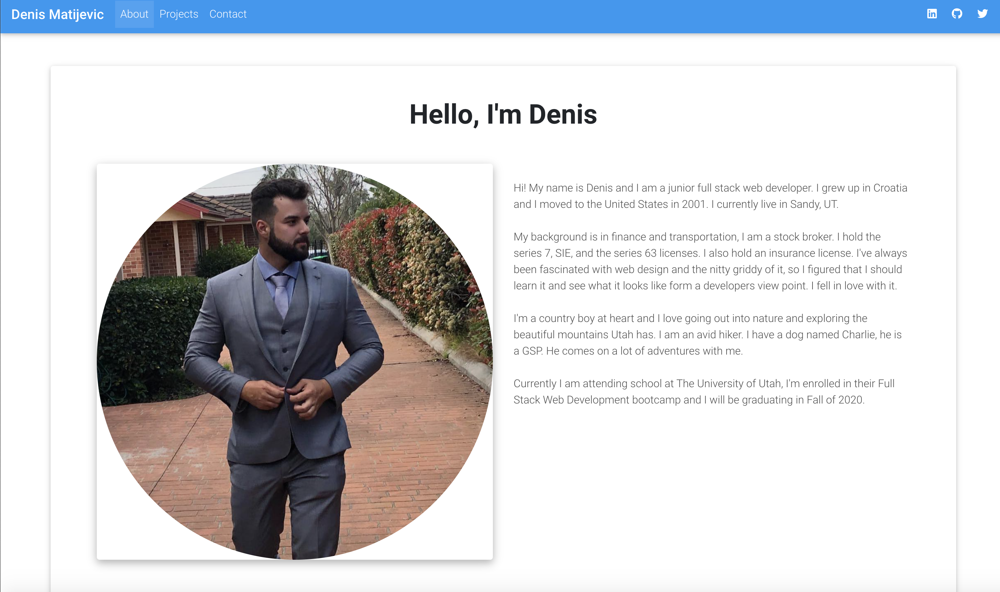

# React Portfolio

# Table of Contents

* [Process](#Process)
* [Issues](#Issues)
* [Video](#Video)
* [Link](#Link)
* [Screenshot](#Screenshot)

## Description
* In this project I've created a responsive portfolio. 
* The portfolio consists of three different tabs, which all work and you can switch back and fourth between them
* The about me includes a picture of me and a description of who I am. 
* The portfolio tab includes links to my github and my linkedin.
* There are clickable pictures which will take you to my team projects.
* The contact tab includes a place for a name, email and a message. 
* I used HTML and CSS to complete this project. I utilzed bootstrap as well.
* Along with a lot of "google fu"

## Issues

## Future-Plans

## Link 

## Screenshot

